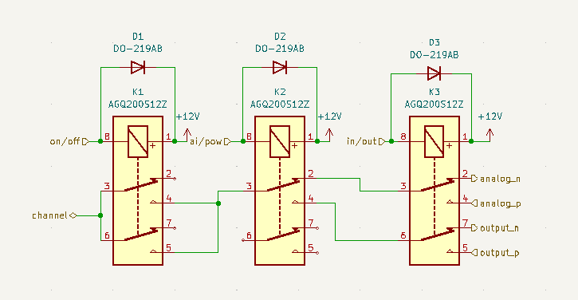
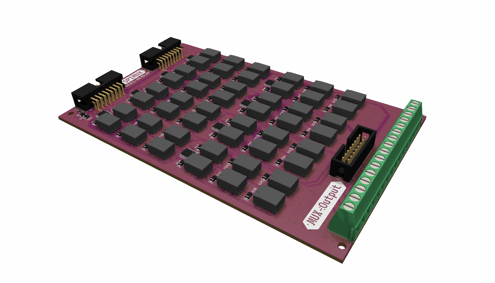

# Shiftreg MUX

[SCHEMATIC](./DOCUMENTATION/spimux_schematics.pdf)
See board construction in Assembly IBOM](https://htmlpreview.github.io/?https://raw.githubusercontent.com/fredriknk/spimux/blob/main/DOCUMENTATION/ibom.html)
## Specifications
| **Parameter**   | **Description**                                                     |
|-----------------|---------------------------------------------------------------------|
| _Input voltage_ | 12v relay, 5v shiftreg/buffer                          			    |
| _Current_       | 150ma@12 relays active  											|
| _Communication_ | spi shiftreg                  						                |
| _Baudrate_      | 1hz-10khz                                                           |
| _PCB size_      | 100x160mm (Eurocard compatible                                      |

## Description
Quick design prototype for a shift registrer based exapndable mux, 
in theory the board should be infinatly stackable, but you will encounter some
interferance and delay issues with she shiftregisters if you use too many boards.

The board has a SPI-input j1, a 2.54mm dual row idc header with a pinout: 

|*pin*	|*type*				|*Description*		|
|-------|-------------------|-----------------------------------------------------------------------------------------------|
|1		|+5v				|5v bus for shift reg and buffers|
|2		|+12v				|12v bus for relays|
|3		|serial_return		|a return path for the serial, can be used to check how many boards are attatched |
|4		|serial_in			|serial input to device	|
|5		|serial_clock		|serial clock signal to device|
|6		|transfer			|transfers the shift reg data to outputs|
|7		|syncronous_clear	|clears entire shift register|
|8		|device_enable		|chip enable spi signal|
|9		|gnd				|gnd|
|10		|gnd				|gnd|
|11		|output_p			|voltage output to mux channel|
|12		|output_n			|voltage output to mux channel|
|13		|gnd				|gnd|
|14		|gnd				|gnd|
|15		|analog_p			|analog positive differential|
|16		|analog_n			|analog negative differential|

The spi shift register is daisy chained so the output of each 8 channel register is connected
to the next in line, and the last register is buffered and sent out SPI-output j2, enabling the possibility 
to stack as many boards you want without any customisation of the boards. 

There are 8 shift registers daisy chained on the board, each shift register has 8 output channels, 

and each register is connected to two relay banks, using output 1,2,3 for relay bank 1 and 5,6,7 for relay bank 2, channel 4 and 8 are left open to get a full byte for each relay group. 

Sending 1110 value to the shift register would turn on the three first relays in the mux (channel 1)

Each relay bank has the following posibilities

On/off bit, this connects/disconnects the channel from the output
ai/pow bit, Analog input/ power, this selects if the channel is used for power or analog
in/out bit, This decides if the channel is an "positive" or "negative".

|*bits*|*Output*|*Type*|*Polarity*   |*channel*|
|-----|---|-----------|--------------|-----|
| b100 | On|analog read| negative side|ch 1.|
| b101 | On|analog read| positive side|ch 1.|
| b110 | on| power| negative|ch 1.|
| b111 | on| power| positive|ch 1.|
| b0XX | off| does not matter| Does not matter|ch 1.|

the fourth bit is not used, and the fift bit is the first bit of the next channel and on the second channel the eight bit is not used. 
This pattern repeats through all the 16 channels on the board.so if you send b00001110, that makes the second channel route to power with positive polarity.
If you connect another boards J1 (spi input) to the first boardds J2 (Spi output) with an idc cable, the second boards first channel would be bit number (4*16+1) = bit 65.

Using this method, any channel on any daisychained board can be connected to the output_p,output_n,analog_p or analog_n on the idc connector just using a bit sequence sent through an SPI output. 

Read about the shift register [here](./DOCUMENTATION/tpic6c596.pdf)

## FRONT

## BACK

